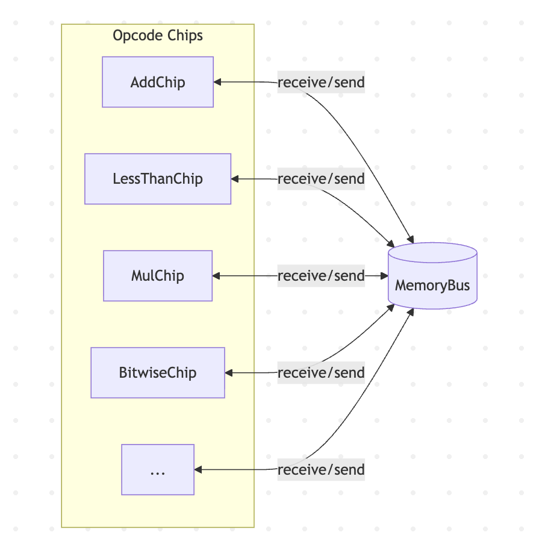

## zkVM core designs

1. The proving of correct execution of VM is often ensured by a set of circuits.

    For example, 
    - RISC-V opcode circuits

    - Read only table like range check table.

2. The circuits communicate with each other through "bus". 
    - read / receive: a circuit A can read message from a bus.
    - write / send: a circuit B can write message to a bus.

    Each bus has a unique id.

- [x] draw a diagram

    
### Recursion design

## Prover Backend

- GKR logup

    - batch all gkr logup records together (SP1)

        - cons: cost a lot of memory to store the logup MLEs.
        - pros: smalller IOP proof.

    - Ceno: batch gkr logup records in one circuit

- Jagged PCS
